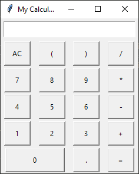

# PYTHON CALCULATOR

---

Hello everyone, this is a sunday monrning project with python.

Using the library tkinter we can build a calculator with its own interface

This is part of the Python Basics Series, feel free to use it.

if you want, fork it and give me a star :)

---

[@maurogome](https://www.twitter.com/maurogome)